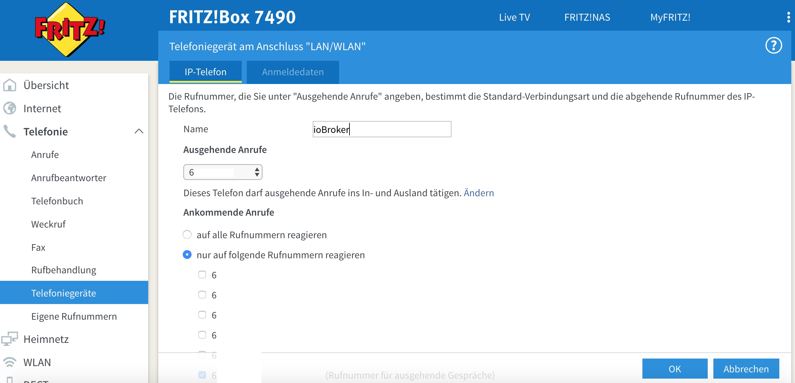

# ioBroker Asterisk VoIP Adapter
===============================

[](https://travis-ci.org/schmupu/ioBroker.asterisk)
[](https://ci.appveyor.com/project/schmupu/ioBroker-asterisk/)
[](https://www.npmjs.com/package/iobroker.asterisk)
[](https://www.npmjs.com/package/iobroker.asterisk)

[](https://nodei.co/npm/iobroker.asterisk/)

The Asterisk adapter converts text messages to audio files and calls then over Asterisk by voip any telephonenumber you want and plays the audo message.

## Install & Configuration

You have to install asterisk for voip calls and ffmpeg to trancode mp3 audofiles to gsm audiofiles on your ioBroker hardware. For creating text messages to audio messages the online text to speach tool from Google will be used. The text message can not be longer than 200 characters.

You cann install asterisk and ffmpeg on Linux (Raspberry), Windows and Apple Macs Computer. If you want to install asterisk in a docker container in bridge modus, you have to expose the UDP ports 5038,5060 and the UDP Ports 7078 to 7097. 

Important: asterisk and ffmpeg hst to be on the same hardware as ioBroker! The reason is that the audio files are stored locally. Maybe I will add an SFTP tranfer of audio files in one of the following versions.

if you use Linux (Raspbery for example) you have to install ffmpeg and asterisk like this: 

```sh
sudo apt-get install ffmpeg
sudo apt-get install asterisk
```

Asterisk has to connect for outgoing calls wiht your voip provider or with your Fritzbox. If you use the Frizbox you have to add a new LAN/WLAN telephone device. In my example the Fritbox has the IP address 192.168.1.1 and the username is *12345689* und the password is *mypassword* . The telphonenumber for outgoing and incoming calls is *03047114711*.




Now you have to edit the follwoing asterisk configuration files. Delete the old staff in this 3 files!   

/etc/asterisk/manager.conf
```sh
[general]
enabled = yes
port = 5038
bindaddr = 0.0.0.0

[manager]
secret=managerpwd
permit=192.168.1.0/255.255.255.0
read=all
write=all
```

/etc/asterisk/sip.conf
```sh
[general]
port = 5060
bindaddr = 0.0.0.0
context = default
subscribecontext = default
;                Username:Password:SIP-Server-IP/Extension of default (subscribecontext)
register => 12345689:mypassword@192.168.1.1/1000

[12345689]
type = friend
username = 123456789
host = 192.168.1.1
secret = mypassword
fromdomain = 192.168.1.1
fromuser = 123456789
callerid= 03047114711
```

/etc/asterisk/extensions.ael
```sh
globals {
	CONSOLE-AEL="Console/dsp"; 		// Console interface for demo
	IAXINFO-AEL=guest;				// IAXtel username/password
	OUTBOUND-TRUNK="Zap/g2";		// Trunk interface
	OUTBOUND-TRUNKMSD=1;			 / MSD digits to strip (usually 1 or 0)
};

context default {
  1000 => {
        Goto(ael-antwort,10,1);
  }
}

context ael-ansage {
        10 => {
                Answer();
                Wait(1);
                for (x=0; ${x} < ${repeat}; x=${x} + 1) {
                        Playback(${file});
			Playback(beep);
                	Wait(1);
                }
		Hangup();
        }
}

context ael-antwort {
	10  => {
		Answer();
		Wait(1);
		Playback(beep);
    		Wait(10);
    		Hangup();
	}
}
```

For starting the asterisk server type */etc/init.d/asterisk start*
Now you have to connect ioBroker with the asterisk server. If the ioBroker and the asterisk server use as IP adress 192.168.1.2 you have to configure this IP and the port, username and password from the */etc/asterisk/manager.conf*.


Now you can use the adapter in your javascript or blocky programs.

```sh
var number  = "040 666-7766";
var msg     = "Hello, this textmessage will be converted to audio"; 

// call telephone nummber 040 666-7766 and play text message as audio
sendTo('asterisk.0', "dial", { telnr: number, text:  msg},  (res) => {
      console.log('Result: ' + JSON.stringify(res));
});  

// call telephone nummber 040 666-7766 and play mp3 audio file
// mp3 file has to exist on asterix server
sendTo('asterisk.0', "dial", { telnr: number, aufiofile: '/tmp/audio.mp3'},  (res) => {
      console.log('Result: ' + JSON.stringify(res));
});  

// call telephone nummber 040 666-7766 and play gsm audio file 
// gsm file has to exist on asterix server
sendTo('asterisk.0', "dial", { telnr: number, aufiofile: '/tmp/audio.gsm'},  (res) => {
      console.log('Result: ' + JSON.stringify(res));
});  
```


## Changelog

### 0.1.3 (12.11.2018)
* (Stübi) Bugfixing

### 0.1.2 (12.11.2018)
* (Stübi) First Version

### 0.1.1 (11.11.2018)
* (Stübi) First Version


## License
The MIT License (MIT)

Copyright (c) 2018 Thorsten <thorsten@stueben.de> / <https://github.com/schmupu>

Permission is hereby granted, free of charge, to any person obtaining a copy
of this software and associated documentation files (the "Software"), to deal
in the Software without restriction, including without limitation the rights
to use, copy, modify, merge, publish, distribute, sublicense, and/or sell
copies of the Software, and to permit persons to whom the Software is
furnished to do so, subject to the following conditions:

The above copyright notice and this permission notice shall be included in
all copies or substantial portions of the Software.

THE SOFTWARE IS PROVIDED "AS IS", WITHOUT WARRANTY OF ANY KIND, EXPRESS OR
IMPLIED, INCLUDING BUT NOT LIMITED TO THE WARRANTIES OF MERCHANTABILITY,
FITNESS FOR A PARTICULAR PURPOSE AND NONINFRINGEMENT. IN NO EVENT SHALL THE
AUTHORS OR COPYRIGHT HOLDERS BE LIABLE FOR ANY CLAIM, DAMAGES OR OTHER
LIABILITY, WHETHER IN AN ACTION OF CONTRACT, TORT OR OTHERWISE, ARISING FROM,
OUT OF OR IN CONNECTION WITH THE SOFTWARE OR THE USE OR OTHER DEALINGS IN
THE SOFTWARE.
