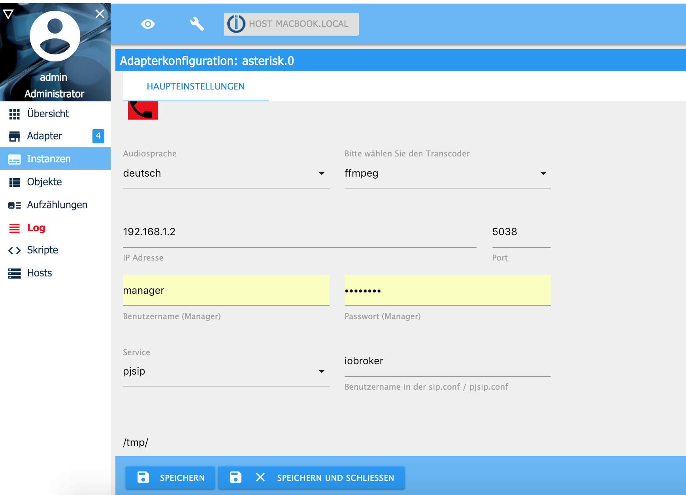

# ioBroker Asterisk VoIP Adapter

## Install & Configuration of Asterisk with the Fritzbox by using PJSIP 

You have to install asterisk for voip calls and ffmpeg to transcode mp3 audofiles to GSM audiofiles on your ioBroker hardware. For creating text messages to audio messages the online text to speach tool from Google will be used. 

You can install asterisk and ffmpeg on Linux (Raspberry), Windows and Apple Macs Computer. If you want to install asterisk in a docker container in bridge modus, you have to expose the UDP ports 5038,5060 and the UDP Ports 7078 to 7097. 

Important: asterisk and ffmpeg has to be on the same hardware as ioBroker! The reason is that the audio files are stored locally and accesable from both aplication. Maybe I will add an SFTP tranfer of audio files in one of the following versions.

If you still want to use separated server for ioBroker and Asterisk there is a work around. You still install ffmpeg on the ioBroker server. You have to share a path on a server (for example with cifs), where both ioBroker and Asterisk have read and write access. The path name must on the asterisk and ioBroker server completle identical. The command *ln -s* will help! You have to enter the path in the ioBroker asterisk adapter configuraton (see screenshot below).

if you use Linux (Raspbery for example) you have to install ffmpeg and asterisk like this: 

```sh
sudo apt-get install ffmpeg
sudo apt-get install asterisk
```

If you have problems with transcoding with ffmpeg you can choose sox as transcoder. For that, you have to install following packages and choose sox in the adapter configuration.

```sh
sudo apt-get install lame
sudo apt-get install sox
sudo apt-get install libsox-fmt-mp3
sudo apt-get install asterisk
```

Asterisk has to connect for outgoing calls with your voip provider or with your fritz.box! If you use the fritz
box! you have to add a new LAN/WLAN telephone device. In my example the frit.box! has the IP address 192.168.1.1 and the user name is *12345689* und the password is *mypassword* . The telphone number for outgoing and incoming calls is *03047114711*.


If you do not want, that ioBroker answer the phone, please leave "nur auf folgende Rufnummern reagieren" empty.  Important, the Fritzbox username (Benutzername) musst only consist of numbers. Example: 12345689, 00004711 or 47110815 !!


Now you have to edit the follwoing asterisk configuration files. Delete the old staff in this 4 files! Do not change the user authority of the files. You have to decide if you want to use the sip.conf or the pjsip.conf . Do not use both files, that would not work!
 
**/etc/asterisk/manager.conf**
```sh
[general]						; Do not change
enabled = yes						; Do not change
port = 5038						; Do not change
bindaddr = 0.0.0.0					; Do not change

[manager]						; Do not change
secret = managerpassword				; Change Manager password for ioBroker asterisk adapter
permit = 192.168.1.0/255.255.255.0  			; Change to your subnet and netmask
read = all						; Do not change
write = all						; Do not change
```

You have to change in */etc/asterisk/manager.conf* the values *secret*, *permit* (your subnet + subnet mask). 

**/etc/asterisk/pjsip.conf** 
```sh
[transport-udp]
type = transport
protocol = udp
bind = 0.0.0.0:5060
 
[iobroker]
type = registration
outbound_auth = iobroker
server_uri = sip:192.168.1.1:5060 ; Username, Password and IP address of Fritzbox WLAN/LAN telephone
client_uri = sip:123456789@192.168.1.1:5060 ; Username, Password and IP address of Fritzbox WLAN/LAN telephone

[iobroker]
type = auth
auth_type = userpass
password = mypassword ; Change password of Fritzbox WLAN/LAN telephone
username = 123456789  ; Change username of Fritzbox WLAN/LAN telephone

[iobroker]
type = aor
contact = sip:192.168.1.1:5060 ; Change hostname / IP address of Fritzbox

[iobroker]
type = endpoint
context = ael-antwort
outbound_auth = iobroker
aors = iobroker
disallow=all
allow=ulaw
allow=alaw
allow=gsm
from_domain = 192.168.1.1 ; Change hostname / IP address of Fritzbox
from_user = 123456789     ; Change username of Fritzbox WLAN/LAN telephone

[iobroker]
type = identify
endpoint = iobroker
match = 192.168.1.1 ; Change hostname / IP address of Fritzbox
```
You have to change in */etc/asterisk/psip.conf* the hostname, username and password configured in the Fritzbox or in the configruation of your VoIP Provider. Pleas do not change the other parameter. 

**/etc/asterisk/extensions.ael**
```sh
context default {
  	1000 => {
        Goto(ael-antwort,s,1);
  	}
}

context ael-ansage {
	10 => {
        Answer();
        Wait(1);
		Read(dtmf,${file}&beep,0,s,${repeat},1);
		if ("${dtmf}"  != "") {
			SayDigits(${dtmf});
		}
		Hangup();
        }
}

context ael-antwort {
	s  => {
		Answer();
		Wait(1);
		Set(repeat=5);
		Read(dtmf,/tmp/asterisk_dtmf&beep,0,s,${repeat},1);
		if ("${dtmf}"  != "") {
			SayDigits(${dtmf});
		}
    		Hangup();
	}
}
```
Copy the content above into the */etc/asterisk/extensions.ael* and do not change anything! If you change something here, your ioBroker dial command will not work.

For starting the asterisk server type */etc/init.d/asterisk start*
Now you have to connect ioBroker with the asterisk server. If the ioBroker and the asterisk server use as IP adress 192.168.1.2 you have to configure this IP and the port, username and password from the */etc/asterisk/manager.conf*. For username sip.conf or pjsip.conf enter *iobroker*. You have enter a path for temporary audio files. This path must be accessible and authorized for Asterisk and ioBroker. 


