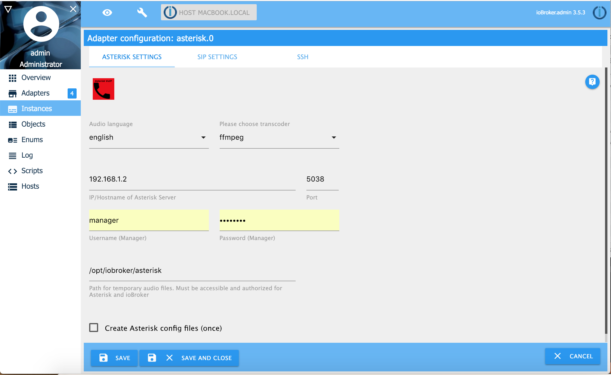
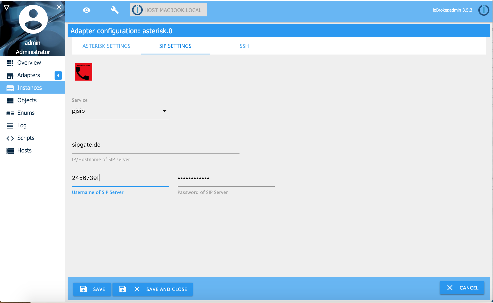

# ioBroker Asterisk VoIP Adapter

## Grundeinstellungen

Du musst für Asterisk das Paket ffmpeg oder sox installieren um MP3-Audiodateien in GSM-Audiodateien umzuwandeln.

Du kannst Asterisk unter Linux (Raspberry), Windows und Apple Macs Computer installieren. Wenn Du Asterisk in einem Docker-Container im Bridge-Modus installieren möchtest, musst Du Sie die UDP-Ports 5038,5060 und die UDP-Ports 7078 bis 7097 im Container exposen.

Asterisk muss auf dem gleichen Server wie ioBroker installiert werden, da auf die Sprachnachrichten (Audiodateien) von ioBroker sowie Asterisk zugegriffen wird.

Sollten ioBroker und Asterisk auf getrennten Servern laufen kannst Du ssh dafür nutzen. Hier wird weiterhin ffmpeg oder sox auf dem ioBroker Server benötigt. Ein ssh Client muss auf dem ioBroker Server und ein ssh Server auf dem Asterisk Server installiert sein. Die Trennung von ioBroker und Asterisk sollte nur vorgenommen werden, wenn man gute Linux Kenntnisse hat.

Unter Linux (z.B. Raspberry) installiere folgende Pakete:

## Installation und Konfiguration

Zuerst musst Du die Verbindung zwischen ioBroker und Asterisk auf der Registerkarte "Asterisk Einstellungen" konfigurieren.
Normalerweise lautet der Benutzername **manager**. Du kannst ein beliebiges Passwort auswählen. Der Benutzername und das Passwort müssen jedoch später mit den Einträgen in der manager.conf identisch sein.
Diese Konfiguration ist unabhängig vom SIP-Provider wie z.B. Fritzbox, Telekom oder Sipgate.
.



Wenn Du mit den "Asterisk Einstellungen" fertig bist, wechsle auf die Registerkarte "SIP Einstellungen". Wähle als Service **pjsip** aus. Gebe nun folgendes ein:

1. IP/Hostname of SIP Server : Gebe hier **sipgate.de** als Hostnamen an
2. Username of SIP Server: Hinterlege hier Deinen Sipgate Id. For Beispiel 2456379f
3. Password of SIP Server: Trage hier Dein Sipgate Passwort eine



### Automatische Erstellung der Asterisk Konfiguration

Gehe auf den Reiter "Asterisk Settings" und aktiviere das Kontrollkästchen "Anlegen der Asterisk Konfigurationsdateien (einmalig)". Drücke anschließend auf „Speichern und Schließen". Nun befinden sich die Konfigurationsdateien im /tmp/ Verzeichnis. Kopiere diese wie unten beschrieben das Verzeichnis /etc/asterisk. Die Benutzerberechtigungen der Dateien im /etc/asterisk Verzeichnis müssen unverändert bleiben. Vielleicht müssen die Berechtigungen nach dem Kopieren angepasst werden.

```sh
sudo mv /tmp/extensions.ael /etc/asterisk/extensions.ael
sudo mv /tmp/manager.conf /etc/asterisk/manager.conf
sudo mv /tmp/pjsip_sipgate.conf /etc/asterisk/pjsip.conf
sudo mv /tmp/rtp.conf /etc/asterisk/rtp.conf

# Example if userrights of files have owner asterisk and group asterisk
sudo chown asterisk:asterisk  /etc/asterisk/extensions.ael
sudo chown asterisk:asterisk /etc/asterisk/manager.conf
sudo chown asterisk:asterisk /etc/asterisk/pjsip.conf
sudo chown asterisk:asterisk /etc/asterisk/rtp.conf

# Asterisk restart
sudo /etc/init.d/asterisk restart
```

Ist der Kopiervorgang abgeschlossen muss erst die Asterisk und danach die Asterisk ioBroker Instanz neu gestartet werden.
Jetzt sollte der Asterisk Adapter funktionieren. Entferne noch die überflüssigen Konfigurationsdateien aus dem /tmp/ Verzeichnis da diese Passwörter enthalten.

### Manuelle Erstellung der Asterisk Konfiguration

Die Konfigurationsdateien können auch manuell erstellt werden. Dafür sind die alten 4 Konfigurationsdateien durch die unten beschriebenen Dateien zu ersetzen. Dabei ändere nicht die Benutzerberechtigungen.

**/etc/asterisk/manager.conf**

```sh
[general]						; Do not change
enabled = yes						; Do not change
port = 5038						; Do not change
bindaddr = 0.0.0.0					; Do not change

[manager]						; Do not change
secret = managerpassword				; Change Manager password for ioBroker asterisk adapter
permit = 0.0.0.0/0.0.0.0                                ; Change to your subnet and netmask if you like
read = all						; Do not change
write = all						; Do not change
```

In der Datei _/etc/asterisk/manager.conf_ ersetzte die Werte für _secret_ und _permit_ mit (your subnet / subnet mask).

**/etc/asterisk/rtp.conf**

```sh
[general]
rtpstart=30000
rtpend=30100
```

In der Datei _/etc/asterisk/rtp.conf_ änderst Du nichts. Kopiere diese nur.

**/etc/asterisk/pjsip.conf**

```sh
[global]
type=global
endpoint_identifier_order=ip,username

[transport-udp]
type = transport
protocol = udp
bind = 0.0.0.0

[iobroker]
type = registration
retry_interval = 20
max_retries = 10
contact_user = sipid
expiration = 120
transport = transport-udp
outbound_auth = iobroker
client_uri = sip:$sipid@sipgate.de:5060
server_uri = sip:sipgate.de:5060

[iobroker]
type = auth
username = $sipid
password = $sippw
realm = sipgate.de

[iobroker]
type = aor
contact = sip:$sipid@sipgate.de

[$sipid]
type = endpoint
context = ael-antwort
dtmf_mode = rfc4733
disallow = all
allow = alaw
rtp_symmetric = yes
force_rport = yes
rewrite_contact = yes
timers = yes
from_user = $sipid
from_domain = sipgate.de
language = en
outbound_auth = iobroker
aors = iobroker

[iobroker]
type = identify
endpoint = $sipid
match = sipgate.de


```

Ersetze in der _/etc/asterisk/psip.conf_ die Platzhalter **sipid** und **sippw** wie beschrieben:

- **$sipid** : Deine SIP Gate Id ohne führendes $
- **$sippw** : Dein SIP Passwort ohne führendes $

In der ioBroker Asterisk Konfiguration nehme folgende Einstellungen vor:

- Die IP-Adresse/Hostname des SIP Servers latutet **sipgate.de**
- Der Benutzername des SIP Servers ist Dein **Sipgate Id ($sipid)**
- Das Passwort des SIP Servers ist Dein **Sipgate password ($sippw)**


**/etc/asterisk/extensions.ael**

```sh
context default {
  	1000 => {
        Goto(ael-antwort,s,1);
  	}
}

context ael-ansage {
	_. => {
        Answer();
        Wait(1);
		Read(dtmf,${file}&beep,0,s,${repeat},1);
		if ("${dtmf}" != "") {
			SayDigits(${dtmf});
		}
		Hangup();
    }

	h =>  {
    	if ("${del}" = "delete") {
				NoOp(/bin/rm ${file}.*);
                System(/bin/rm ${file}.*);
		}
	}
}

context ael-antwort {
	s  => {
		Answer();
		Wait(1);
		Set(repeat=5);
		Read(dtmf,/tmp/asterisk_dtmf&beep,0,s,${repeat},1);
		if ("${dtmf}" != "") {
			SayDigits(${dtmf});
		}
    	Hangup();
	}

	_.  => {
        Goto(ael-antwort,s,1);
  	}
}
```

Ersetze den Inhalt der Datei _/etc/asterisk/extensions.ael_ ohne Änderungen.

Nun muss der Asterisk Server neu gestartet werden. Dieses geschieht z.b. über _/etc/init.d/asterisk restart_. Nun sollte sich ioBroker mit dem Asterisk Server verbinden.
