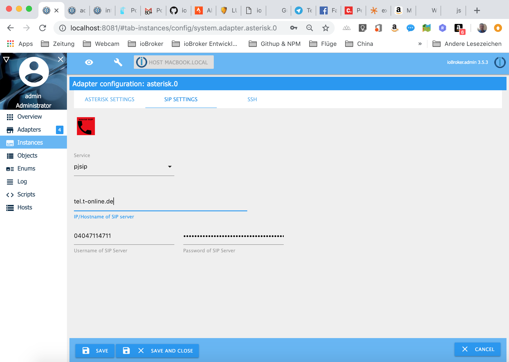
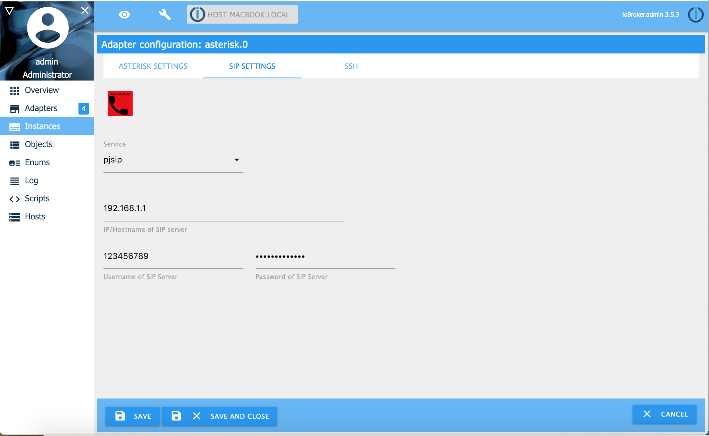

# ioBroker Asterisk VoIP Adapter

## Install / Basic setting

You have to install asterisk for voip calls and ffmpeg to transcode mp3 audofiles to GSM audiofiles on your ioBroker hardware. For creating text messages to audio messages the online text to speach tool from Google will be used. 

You can install asterisk and ffmpeg on Linux (Raspberry), Windows and Apple Macs Computer. If you want to install asterisk in a docker container in bridge modus, you have to expose the UDP ports 5038,5060 and the UDP Ports 7078 to 7097. 

You shall install asterisk and ffmpeg on the same hardware as ioBroker! The reason is that the audio files are stored locally and accessible from ioBroker and asterisk. 

If you want still using separated server for ioBroker and Asterisk you can use the ssh support. You still install ffmpeg or sox on the ioBroker server. Asterisk and a ssh server on the asterisk server. You find the detailed installation [here ](docs/SSH.md).

if you use Linux (Raspberry for example) and ioBroker and asterisk runs on the same server, you have to install ffmpeg and asterisk like this: 

### Linux Packages / ioBroker & asterisk running on same server with ffmpeg 
```sh
sudo apt-get install ffmpeg
sudo apt-get install asterisk
```

### Linux Packages / ioBroker & asterisk running on same server with sox 
If you have problems with transcoding with ffmpeg you can choose sox as transcoder. For that, you have to install following packages and choose sox in the adapter configuration.

```sh
sudo apt-get install lame
sudo apt-get install sox
sudo apt-get install libsox-fmt-mp3
sudo apt-get install asterisk
```

## Install & Configuration of Asterisk with the provider Telekom by using PJSIP 

Configure the connection from ioBroker to the Asterisk server on "Asterisk Settings" tab. 
This configuration is independent if you use as SIP Provider your Fritzbox, Telekom, Sipgate or an other vendor. Normaly the username is **manager** . You can choose any password you want. But manager username and manager password in ioBroker must be the same as in the manager.conf later.


If you are done with the configuration of "Asterisk Settings" you switch to the "SIP Settings" tab. Choose **pjsip** as Service. Now you have to enter following:

1. IP/Hostname of SIP Server : enter **tel.t-online.de** as hostname 
2. Username of SIP Server: insert your telephonenumber with areacode here (no country code!). For example: 03047114711 (no spaces)
3. Password of SIP Server: Your Password has to be like this  **PIN:ZUGANGSNUMMER-MITBENUTZERNUMMER** . For Example: 23457830:323127211711-0001



### Automatic creating asterisk configuration files

Now you go on the "Asterisk Settings" tab and activate the checkbox "create asterisk config files (once)". Save and start the Asterisk instance. 
copy following files from your /tmp/ to the /etc/asterisk/ directory. Please take a look first which user rights the files have before copying in  /etc/asterisk . Maybe you have to adjust the user rights afterwards.

```sh
sudo mv /tmp/extensions.ael /etc/asterisk/extensions.ael
sudo mv /tmp/manager.conf /etc/asterisk/manager.conf
sudo mv /tmp/pjsip_telekom.conf /etc/asterisk/pjsip.conf
sudo mv /tmp/rtp.conf /etc/asterisk/rtp.conf

# Example if userrights of files have owner asterisk and group asterisk
sudo chown asterisk:asterisk  /etc/asterisk/extensions.ael
sudo chown asterisk:asterisk /etc/asterisk/manager.conf
sudo chown asterisk:asterisk /etc/asterisk/pjsip.conf
sudo chown asterisk:asterisk /etc/asterisk/rtp.conf
```

Now start asterisk again. For example with /etc/init.d/asterisk restart and restart the Asterisk iobroker instance. 
Everything shall work now and you are done with the configuration.
Please delete all config files in the /tmp/ directory, because your password is provide in the files.

### Manual creating asterisk configuration files

Instead of creating the config files automatically, you can do it by your own. 
Now you have to edit the follwoing asterisk configuration files. Delete the old staff in this 4 files! Do not change the user authority of the files. 
 
**/etc/asterisk/manager.conf**
```sh
[general]						; Do not change
enabled =  yes						; Do not change
port =  5038						; Do not change
bindaddr =  0.0.0.0					; Do not change

[manager]						; Do not change
secret =  managerpassword				; Change Manager password for ioBroker asterisk adapter
permit = 0.0.0.0/0.0.0.0                                ; Change to your subnet and netmask if you like
read =  all						; Do not change
write =  all						; Do not change
```
You have to change in */etc/asterisk/manager.conf* the values *secret*, *permit* (your subnet + subnet mask). 

**/etc/asterisk/rtp.conf**
```sh
[general]
rtpstart = 30000
rtpend = 30100
```
You have to change in */etc/asterisk/rtp.conf* the values *secret*, *permit* (your subnet + subnet mask). 

**/etc/asterisk/pjsip.conf** 
```sh
[global]
type = global
endpoint_identifier_order = ip,username

[transport-udp]
type = transport
protocol = udp
bind = 0.0.0.0

[transport-tcp]
type = transport
protocol = tcp
bind = 0.0.0.0

[iobroker]
type = registration
transport = transport-udp
outbound_auth = iobroker
server_uri = sip:tel.t-online.de
client_uri = sip:$countrymynumber@tel.t-online.de	; Change here
contact_user = $mynumber
retry_interval = 60
forbidden_retry_interval = 300
expiration = 480
auth_rejection_permanent = false

[iobroker]
type = auth
auth_type = userpass
password = $pin:$zugangsnummer-$mitbenutzernr@t-online.de ; Change here
username = $mynumber
realm = tel.t-online.de

[iobroker]
type = aor
contact = sip:$countrymynumber@tel.t-online.de	; Change here

[$mynumber]
type = endpoint
transport = transport-udp
context = ael-antwort
disallow = all
allow = g722
allow = alaw
outbound_auth = iobroker
aors = iobroker
callerid = $mynumber	; Change here
from_user = $mynumber	; Change here
from_domain = tel.t-online.de
timers = no
rtp_symmetric = yes

[iobroker]
type = identify
endpoint = $mynumber
match = 217.0.0.0/13

```
You have to change in */etc/asterisk/psip.conf* a view things. Please replace the place holder **$mynumber**, ... like described:

- **$mynumber**			    : my telephonenumber with areacode. For example: 03047114711 (no spaces)
- **$countrymynumber**	    : my telephonenumber with countrycode. For example: +493047114711 (no spaces)
- **$zugangsnummer**		: zungangsnummer like 532496966969
- **$mitbenutzernr**		: Mitbenutzernummer like 0001
- **$pin**					: your Telekom password (persönliches Kennwort) like 34242322

In the ioBroker Asterisk Admin you have to do following adjustments
- The IP/Hostname of SIP Server must be **tel.t-online.de**
- The Username of SIP Server must be **Telekom telphonenumber ($mynumber)** (with area code, no spaces, no contry code)
- The Password of SIP Server must be **pin:zugangsnummer-mitbenutzernr** of your telekom account


**/etc/asterisk/extensions.ael**
```sh
context default {
  	1000  => {
        Goto(ael-antwort,s,1);
  	}
}

context ael-ansage {
	_. 	=> {
        Answer();
        Wait(1);
		Read(dtmf,${file}&beep,0,s,${repeat},1);
		if ("${dtmf}"  ! =  "") {
			SayDigits(${dtmf});
		}
		Hangup();
        }
}

context ael-antwort {
	s   => {
		Answer();
		Wait(1);
		Set(repeat = 5);
		Read(dtmf,/tmp/asterisk_dtmf&beep,0,s,${repeat},1);
		if ("${dtmf}"  ! =  "") {
			SayDigits(${dtmf});
		}
    		Hangup();
	}

	_.  => {
        Goto(ael-antwort,s,1);
  	}
	  
}
```
Copy the content above into the */etc/asterisk/extensions.ael* and do not change anything! If you change something here, your ioBroker dial command will not work.

For starting the asterisk server type */etc/init.d/asterisk start*
Now you have to connect ioBroker with the asterisk server. If the ioBroker and the asterisk server use as IP adress 192.168.1.2 you have to configure this IP and the port, username and password from the */etc/asterisk/manager.conf*. For username sip.conf or pjsip.conf enter *iobroker*. You have enter a path for temporary audio files. This path must be accessible and authorized for Asterisk and ioBroker. 


