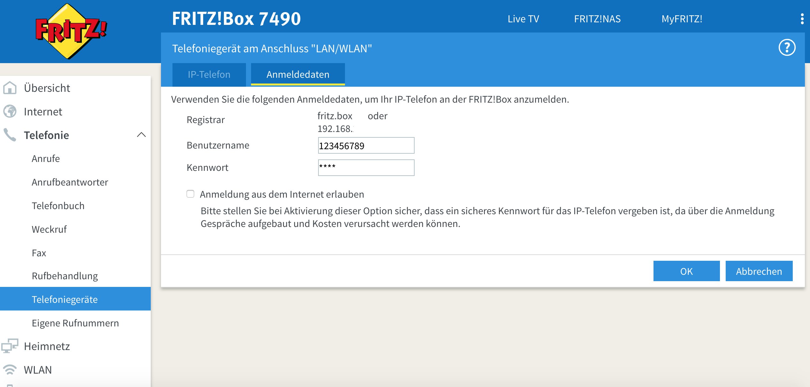
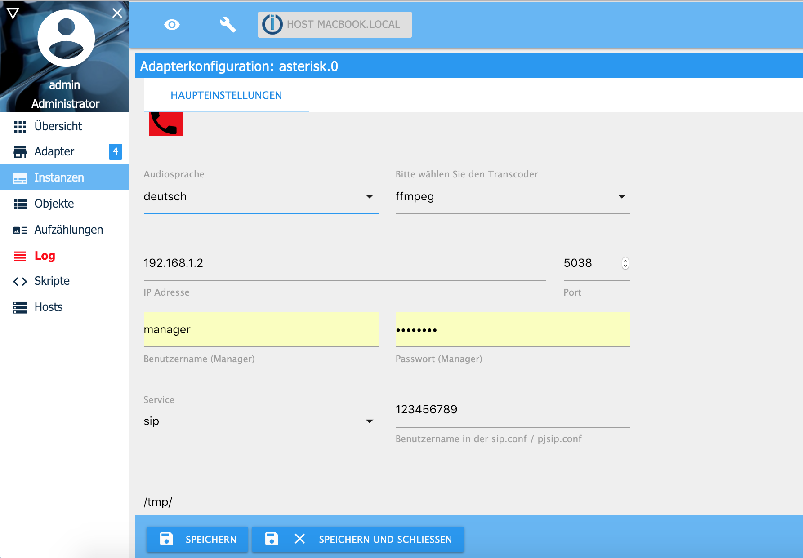

# ioBroker Asterisk VoIP Adapter

## Installation und Grundeinstellungen

Dus musst für Asterisk das Paket ffmpeg oder sox installieren um MP3-Audiodateien in GSM-Audiodateien umzuwandeln. 

Du kannst Asterisk unter Linux (Raspberry), Windows und Apple Macs Computer installieren. Wenn Du Asterisk in einem Docker-Container im Bridge-Modus installieren möchtest, musst Du Sie die UDP-Ports 5038,5060 und die UDP-Ports 7078 bis 7097 im Container exposen.

Asterisk muss auf dem gleichen Server wie ioBroker installiert werden, da auf die Sprachnachrichten (Audiodateien) von ioBroker und Asterisk zugegriffen wird.

Sollten ioBroker und Asterisk auf getrennten Servern laufen kannst Du SSH nutzen. Hier wird weiterhin ffmpeg oder sox auf dem ioBroker Server benötigt. Ein SSH Server muss auf dem Asterisk Server installiert sein. Eine detaillierte Installationsanleitung findest Du hier (SSH_DE.md).

Unter Linux (z.B. Raspberry) installiere folgende Pakete:

### Linux Pakckete / ioBroker & Asterisk laufen auf dem gleichen Server 
```sh
sudo apt-get install ffmpeg
sudo apt-get install lame
sudo apt-get install sox
sudo apt-get install libsox-fmt-mp3
sudo apt-get install asterisk
```

## Installation und Konfiguration

Zunächst musst Du in der Fritzbox ein neues LAN / WLAN Telefongerät hinzufügen. 
In meinem Beispiel hat die FritzBox die IP-Adresse 192.168.1.1, der Benutzername und Kennwort des LAN / WLAN Telefongeräts lautet *12345689* und *meinPasswort*. Die Telefonnummer für abgehende und ankommende Anrufe ist * 03047114711 *.


Wenn Du nicht möchten das ioBroker auf eingehende Anrufe reagiert, lasse  einfach  "nur auf folgende Rufnummern reagieren" leer. Wichtig ist, dass der Benutzername des Fritzbox LAN / WLAN Telefongeräts nur aus Zahlen besteht. Beispiel: 12345689, 00004711 oder 47110815!



 
Zuerst musst Du die Verbindung zwischen ioBroker und  Asterisk auf der Registerkarte "Asterisk Einstellungen" konfigurieren.
Normalerweise lautet der Benutzername **manager**. Du kannst ein beliebiges Passwort auswählen. Der Benutzername und das Passwort müssen jedoch später mit den Einträgen in der manager.conf identisch sein.
Diese Konfiguration ist unabhängig vom  SIP-Provider wie z.B. Fritzbox, Telekom oder Sipgate.


Wenn Du mit den "Asterisk Einstellungen" fertig bist, wechsle auf die Registerkarte "SIP Einstellungen". Wähle als Service **sip** aus.  Gebe nun folgendes ein:

1. IP/Hostname des SIP Servers: Die IP Adresse Deiner Fritzbox (in unserem Beispiel 192.18.1.1)  
2. Benutzername des SIP Servers: Hier trägst du den Benutzernamen der auf dem Reiter Anmeldedaten Deines Fritzbox Telefoniegeräts steht ein (in unserem Beispiel 123456789)
3. Password of SIP Server: Hier trägst du das Kennwort welches auf dem Reiter Anmeldedaten Deines Fritzbox Telefoniegeräts steht ein 



Die Registerkarte "SSH" lässt Du leer. Diese ist nur auszufüllen wenn Asterisk nicht auf dem gleichen Server wie ioBroker läuft.
Mehr Infos dazu findest Du unter [ssh/scp](SSH_DE.md).

### Automatische Erstellung der Asterisk Konfiguration

Now you go on the "Asterisk Settings" tab and activate the checkbox "create asterisk config files (once)". Save and start the Asterisk instance. 
copy following files from your /tmp/ to the /etc/asterisk/ directory. Please take a look first which user rights the files have before copying in  /etc/asterisk . Maybe you have to adjust the user rights afterwards.

```sh
sudo mv /tmp/extensions.ael /etc/asterisk/extensions.ael
sudo mv /tmp/manager.conf /etc/asterisk/manager.conf
sudo mv /tmp/sip_fritzbox.conf /etc/asterisk/sip.conf
sudo mv /tmp/rtp.conf /etc/asterisk/rtp.conf

# Example if userrights of files have owner asterisk and group asterisk
sudo chown asterisk:asterisk  /etc/asterisk/extensions.ael
sudo chown asterisk:asterisk /etc/asterisk/manager.conf
sudo chown asterisk:asterisk /etc/asterisk/sip.conf
sudo chown asterisk:asterisk /etc/asterisk/rtp.conf
```

Now start asterisk again. For example with /etc/init.d/asterisk restart and restart the Asterisk iobroker instance. 
Everything shall work now and you are done with the configuration.
Please delete all config files in the /tmp/ directory, because your password is provide in the files.

### Manual creating asterisk configuration files

Instead of creating the config files automatically, you can do it by your own. 
Now you have to edit the follwoing asterisk configuration files. Delete the old staff in this 4 files! 
Do not change the user authority and user rights of the files. 

**/etc/asterisk/manager.conf**
```sh
[general]						; Do not change
enabled = yes						; Do not change
port = 5038						; Do not change
bindaddr = 0.0.0.0					; Do not change

[manager]						; Do not change
secret = managerpassword				; Change Manager password for ioBroker asterisk adapter
permit = 0.0.0.0/0.0.0.0                                ; Change to your subnet and netmask if you like
read = all						; Do not change
write = all						; Do not change
```

You have to change in */etc/asterisk/manager.conf* the values *secret*, *permit* (your subnet + subnet mask). 

**/etc/asterisk/rtp.conf**
```sh
[general]
rtpstart=30000
rtpend=30100
```
You have to change in */etc/asterisk/rtp.conf* nothing. Copy only this file.

**/etc/asterisk/sip.conf** 
```sh
[general]				; Do not change
port = 5060				; Do not change
bindaddr = 0.0.0.0			; Do not change
context = default			; Do not change
subscribecontext = default		; Do not change


register => 12345689:mypassword@192.168.1.1/1000 ; Username, Password and IP address of Fritzbox WLAN/LAN telephone

[123456789]               		; Change to username of Fritzbox WLAN/LAN telephone
type = friend			    	; Do not change
username = 123456789      		; Change to username of Fritzbox WLAN/LAN telephone
host = 192.168.1.1        		; Change hostname / IP address of Fritzbox
secret = mypassword       		; Change password of Fritzbox WLAN/LAN telephone
fromdomain = 192.168.1.1  		; Change hostname / IP address of Fritzbox
fromuser = 123456789   	  		; Change username of Fritzbox WLAN/LAN telephone
```

You have to change in */etc/asterisk/sip.conf* the *host* (IP Adress of Fritzbox or VoIP Provider), the *secret*, *username*, *fromuser* with the username configured in the Fritzbox or VoIP Provider. 
Change the *callerid* with your phone number configured in the Fritzbox. Important, the Fritzbox username (Benutzername) musst only consist of number. Example: 12345689, 00004711 or 47110815 !!

**/etc/asterisk/extensions.ael**
```sh
context default {
  	1000 => {
        Goto(ael-antwort,s,1);
  	}
}

context ael-ansage {
	_. => {
        Answer();
        Wait(1);
		Read(dtmf,${file}&beep,0,s,${repeat},1);
		if ("${dtmf}"  != "") {
			SayDigits(${dtmf});
		}
		Hangup();
        }
}

context ael-antwort {
	s  => {
		Answer();
		Wait(1);
		Set(repeat=5);
		Read(dtmf,/tmp/asterisk_dtmf&beep,0,s,${repeat},1);
		if ("${dtmf}"  != "") {
			SayDigits(${dtmf});
		}
    		Hangup();
	}
}
```
Copy the content above into the */etc/asterisk/extensions.ael* and do not change anything! If you change something here, your ioBroker dial command will not work.

For starting the asterisk server type */etc/init.d/asterisk start*
Now you have to connect ioBroker with the asterisk server. If the ioBroker and the asterisk server use as IP adress 192.168.1.2 you have to configure this IP and the port, username and password from the */etc/asterisk/manager.conf* and the unsername of your sip.conf (for example 123456789). You have enter a path for temporary audio files. This path must be accessible and authorized for Asterisk and ioBroker. 

